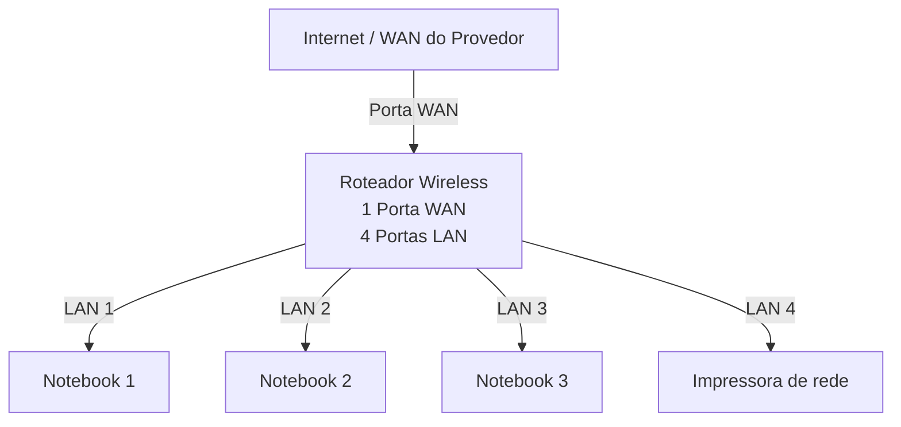

# lab-redes-01

# Laboratório de Redes 01 - Projeto de Rede Local

Aluno: Sara Oliveira

Professor: José de Assis

Data: 09/03/2026

---

## 1- Objetivo

Implementar uma rede local  simples conectando 3 notebooks a um computador wirelwss com switch e uma impressora de rede.

O projeto será dividido em duas etapas:

1. Simulação da rede no Cisco Packet Tracer
2. Implementação da rede no labotório real
   
---

## 2. Equipamentos Utilizados nesse laboratório:

- 3 Notebooks
- 1 Roteador Wireless com 1 porta WAN e 4 portas LAN
- 1 Impressora de Rede
- Cabos de rede

---

## 3. Topologia da Rede

Diagrama lógico da rede usada neste laboratório.

                                               Imagem da Topologia usada neste laboratório

  

## 4. Plano de endereçamento IP

Rede: 192.168.0.0/24

Gateway: 192.168.0.1

| Dispositivo | Tipo de IP | Endereço IP | Observação |
|-------------|------------|-------------|------------|
| Roteador | Estático | 192.168.0.1 | IP do Roteador |
| Impressora | Reserva DHCP | 192.168.0.105 | IP Reservado pelo roteador |
| PC1 | Reserva DHCP | 192.168.0.103 | IP Reservado pelo roteador |
| PC2 | DHCP | Automático | IP Reservado pelo roteador |
| PC3 | DHCP | Automático | IP atribuído pelo roteador |

**Observação**

- A impressora e um dos notebooks utilizam reserva DHCP.
- O roteador sempre atribui o mesmo endereço de IP a esses dispositivos.
  
---

<!--
## 5. Implementação do laboratório real:

Após a instalação, a rede foi montada fisicamente no laboratório.

Etapas realizadas:

(fotos e capturas de tela realizadas durante o laboratório)
Testes:

(fotos e capturas de tela realizadas durante o laboratório)
-->
## 5. Conclusão

Este laboratório permitiu compreender o funcionamento de uma rede local simples, incluindo:

- Estrutura de uam rede doméstica ou de pequeno escriitório (rede local)
- Utilização de um roteador com parta WAN e portas LAN
- Funcionamento DHCP
- Comunicação entre dispositivos na rede local
- Utilização de uma impressora de rede
- Compartilhamento da pasta na rede usando o Windows
- Jogos em redes locais

